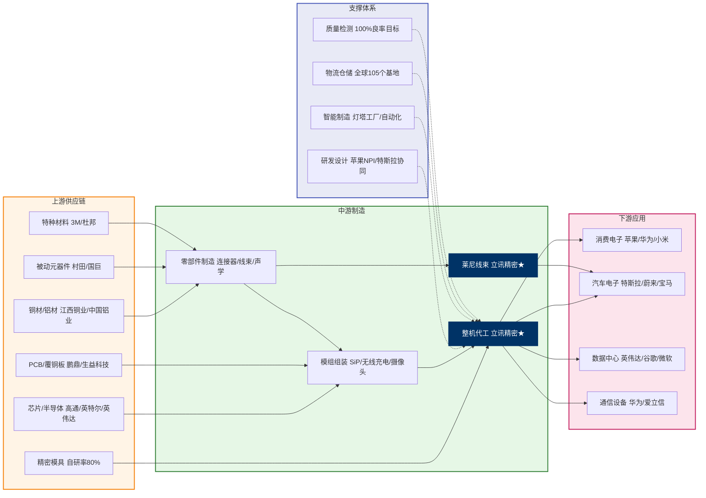

# 立讯精密 (002475.SZ) Research Document

> Generation Date: 2026-06-26
> Data Cutoff: 2026-06-26
> Market: A-share
> Language: Chinese

---

## Task Handoff Metadata

| Field | Value |
|-------|-------|
| `output_type` | EQUITY_REPORT |
| `report_language` | zh-CN |
| `css_container_class` | .report-container |
| `market` | A-share |
| `ticker` | 002475.SZ |
| `company_name` | 立讯精密工业股份有限公司 |
| `company_name_en` | Luxshare Precision Industry Co., Ltd. |
| `currency` | CNY |
| `page_target` | 25-40 |
| `benchmark_index` | 000001.SH |
| `benchmark_name` | 上证指数 |
| `module_count` | 21 |
| `stock_chart_path` | 002475_52week_chart.svg |
| `stock_csv_path` | 002475_52week.csv |
| `benchmark_csv_path` | 000001_52week.csv |
| `report_date` | 2026-06-26 |
| `latest_financial_report` | FY2025 Annual Report |
| `current_price` | ¥67.12 |

---

## I. Core Investment Narrative (400-600 words)

立讯精密是中国乃至全球消费电子精密制造领域的绝对龙头，正处于从"果链代工企业"向"跨消费电子、AI算力基础设施、汽车电子三大赛道的平台型精密制造企业"转型的关键阶段。公司2025年实现营业收入3323.44亿元，同比增长23.64%，归母净利润165.998亿元，同比增长24.20%，扣非归母净利润141.69亿元，同比增长21.16%，加权平均净资产收益率达21.10%，核心盈利指标均保持20%以上的稳健增速，在全球电子制造服务（EMS）行业中处于领先地位。

从行业趋势来看，全球消费电子市场正经历AI驱动的创新周期。AI手机、AI可穿戴设备等新兴产品需求带动下，消费电子行业进入新一轮换机潮。同时，全球AI算力基础设施建设需求爆发，高速互连、液冷、电源等产品订单快速增长。汽车智能化渗透率提升，2030年汽车电子市场规模预计达1.2万亿元（CAGR 15%）。立讯精密三大核心业务板块——消费电子、汽车电子、通讯及数据中心——均精准卡位这些高景气赛道。

公司的差异化竞争优势在于其"零件—模组—整机"的垂直整合能力。在消费电子领域，公司AirPods代工份额超50%稳居全球第一，iPhone代工份额持续提升，是苹果供应链中中国大陆最重要的合作伙伴之一。更重要的是，公司正通过收购德国莱尼集团、布局高速铜连接和光模块业务、与OpenAI合作开发消费级AI硬件等方式，构建技术+生态双壁垒。截至2025年底，公司累计拥有专利9367件，研发投入114.28亿元，占营收3.44%，研发团队达34357人。

从财务轨迹看，公司2025年毛利率11.91%，同比提升1.50个百分点，主要受益于高毛利率板块（通讯及数据中心18.40%、汽车电子15.75%）收入占比提升。第一大客户（苹果）销售占比从2024年的70.74%降至56.68%，客户结构优化降低了单一客户依赖风险。2026年一季度营收838.88亿元，同比增长35.77%，归母净利润36.60亿元，同比增长20.24%，延续高增长态势。

估值方面，当前股价67.12元对应PE(TTM)约17-21倍（不同数据源略有差异），处于历史中低位区间。根据国海证券预测，2026-2028年公司归母净利润分别为211.10/270.97/334.56亿元，对应PE分别为23/18/15倍。考虑到公司汽车电子业务185%的爆发式增长、AI算力基建业务的快速突破，以及OpenAI合作等催化剂，当前估值具备安全边际。

关键催化剂包括：2026年下半年iPhone 17系列量产放量、OpenAI消费级硬件原型开发进展、港股IPO落地、汽车电子业务持续高增。主要风险在于：苹果供应链多元化带来的订单份额波动、地缘政治与关税风险、以及高速互连领域技术竞争加剧。

综合来看，立讯精密正处于从"制造龙头"向"科技平台"跃迁的关键节点，短期业绩确定性高，长期成长空间广阔，当前估值具备吸引力，给予"买入"评级。

---

## II. Six-Dimension Deep Analysis (1,500-2,400 words total)

### 2.1 Competitive Landscape (H1) — 250-400 words

**Conclusion**: 立讯精密在全球消费电子精密制造领域处于绝对领先地位，垂直整合能力构成核心护城河，但汽车电子和AI算力领域面临传统Tier1和光模块龙头的激烈竞争。

**Data Support**:
- 全球消费电子EMS市场份额：约12-14%，智能穿戴领域占头部客户70%配件供应份额
- 苹果AirPods代工份额：超50%，全球第一
- 苹果充电模组订单份额：约72%
- 汽车线束：收购莱尼后跻身全球第四位
- 主要竞争对手：工业富联（601138）、歌尔股份（002241）、蓝思科技（300433）、鹏鼎控股（002938）、中航光电（002179）

**Competitive Moat**: 立讯精密的核心护城河是"垂直整合+精密制造+客户绑定"的三位一体能力。公司从连接器起家，逐步打通零部件到整机制造全环节，实现了"零件—模组—整机"的垂直整合。这种能力使得公司能够在苹果供应链中从早期的连接线供应商，发展为AirPods核心组装商、iPhone整机代工厂，以及Apple Vision Pro等高端产品的核心供应商。垂直整合不仅带来了成本优势（制造成本低于同业10-15%），更重要的是提高了客户切换成本——苹果需要供应商具备快速响应、高质量交付和深度研发协同能力，而立讯在这些方面的能力已经经过十余年验证。在汽车电子领域，公司通过收购德国莱尼集团获得了全球化产能和技术优势，并与奇瑞成立合资公司布局整车ODM模式，目标是为车企提供从零部件到整车的全链条服务。然而，在AI算力领域，公司光模块业务才刚起步，与行业龙头相比技术积累尚有差距，铜连接领域虽然具备优势，但面临泰科、安费诺等国际巨头的竞争。

**So What**: 公司在消费电子领域的竞争优势稳固，短期3-5年内难以被撼动，这为公司提供了稳定的现金流基础。汽车电子和AI算力是新的增长引擎，但竞争格局尚未固化，需要持续跟踪公司在这些领域的技术突破和市场份额变化。在估值中，消费电子业务应给予稳健倍数，而新业务应给予成长溢价。

### 2.2 Growth Drivers (H2) — 250-400 words

**Conclusion**: 公司增长由三大引擎驱动：消费电子稳健增长（AI换机潮）、汽车电子爆发式增长（莱尼并表+智驾渗透）、通讯及数据中心高增（AI算力基建）。未来3年有望维持20%+的复合增速。

**Data Support**:
- Revenue CAGR (3Y, 2022-2025): 约15.6%（从2140亿到3323亿）
- 2025年增速：+23.64%
- 2026Q1增速：+35.77%
- 汽车电子2025年增速：+185.34%
- 通讯及数据中心2025年增速：+33.81%
- 消费电子2025年增速：+13.37%
- Consensus FY+1/FY+2 revenue growth: +23%/+14%（国海证券）

**Sustainability**: 从TAM角度看，消费电子全球市场规模约1万亿美元，公司占比约5%，仍有提升空间。AI终端驱动换机潮，2025年AI手机订单预计增长500%。汽车电子领域，全球汽车线束市场规模约500亿美元，公司收购莱尼后份额约4-5%，随着智能驾驶渗透率提升，2030年市场规模预计达1.2万亿元（CAGR 15%）。通讯及数据中心领域，全球800G/1.6T光模块市场2025年规模超50亿美元，公司虽然起步晚但进展迅速。从增长质量看，公司2025年毛利率11.91%同比提升1.50个百分点，说明增长不仅来自规模扩张，也来自结构优化。管理层执行力方面，公司近三年累计研发投入超280亿元，累计拥有专利9367件，技术储备深厚。2025年研发投入114.28亿元，同比增长33.57%，研发人员数量同比增长52.14%，其中硕士及以上学历研发人员同比增长335.25%，研发团队规模和质量同步提升。

**So What**: 三大增长引擎的可持续性较强，尤其是汽车电子和AI算力业务处于早期爆发阶段，有望在未来3-5年持续贡献超额增长。估值上应给予成长溢价，但需关注消费电子增速放缓和新业务基数效应带来的增速回落。

### 2.3 Earnings Quality (H3) — 250-400 words

**Conclusion**: 公司盈利质量总体良好，但需关注经营现金流同比下降、汇兑损失增加、以及客户集中度仍较高的风险。

**Data Support**:
- OCF/Net Income: 2025年经营现金流173.25亿元/净利润165.998亿元 = 1.04x，但同比下降36.11%
- 非经常性损益：2025年扣非净利润141.69亿元 vs 归母净利润165.998亿元，差额24.31亿元（主要来自政府补助、投资收益等）
- 应收账款周转：2025年应收账款规模随业务扩张增加，需关注DSO变化
- 存货周转：2025年存货规模随业务扩张增加，需关注DIO变化

**Anomaly Flags**: 首先，2025年经营活动产生的现金流量净额173.25亿元，同比下降36.11%，主要系报告期内业务规模扩张、合并范围增加带来的采购和运营支出同步增长所致。虽然整体现金流状况仍能支撑公司日常运营和投资需求，但下降幅度较大需要关注。其次，2026年一季度财务费用率1.25%，同比提升1.29个百分点，主要系汇兑损失增加。自2025年第四季度起，外汇市场波动加剧，导致财务费用中汇兑损失增加，但公司通过远期外汇等衍生品工具积极开展风险对冲。第三，客户集中度仍较高，2025年前五大客户合计销售占比65.04%，第一大客户（苹果）占比56.68%，虽然较2024年的70.74%有所下降，但单一客户依赖风险依然存在。第四，2025年非经常性损益占净利润比例约14.6%，主要来自政府补助和投资收益，需关注其持续性。

**So What**: 盈利质量总体可控，但现金流下降和汇兑损失增加需要纳入预测假设的保守调整。客户集中度风险是结构性问题，需要通过业务多元化持续缓解。在预测中，应对经营现金流和净利润的比率保持谨慎假设。

### 2.4 Valuation & Expectations (H4) — 250-400 words

**Conclusion**: 当前估值处于历史中低位，市场对公司新业务（汽车电子、AI算力）的成长潜力定价不足，存在正向预期差。

**Data Support**:
- PE(TTM): 约17-21倍（不同数据源）
- 5Y avg PE: 约22-25倍（基于历史数据推算）
- Forward PE (FY2026E): 约23倍（国海证券）
- Forward PE (FY2027E): 约18倍
- Peer median PE: 工业富联约35倍，歌尔股份约25-30倍
- PB: 约4.46倍（2025年8月数据）
- PEG: 约0.8-1.0（基于20%+增速和20x PE）

**Expectation Gap**: 市场当前定价主要反映了公司作为"果链代工龙头"的稳健增长预期，但对以下因素定价不足：1）汽车电子业务的爆发潜力——2025年汽车电子收入392.55亿元，同比+185.34%，毛利率15.75%，随着莱尼整合深化和智驾渗透率提升，该业务有望在未来3-5年成长为千亿级业务板块；2）AI算力基建业务的突破——公司在铜连接、液冷散热、电源模块等领域取得多个客户重要突破，800G/1.6T光模块研发进展迅速；3）OpenAI合作——如果消费级AI硬件在2027-2028年量产，将为公司带来全新的增长曲线。当前估值隐含的未来3年净利润增速约15-18%，而公司实际有望实现25-30%的复合增速，存在正向预期差。催化剂方面，2026年下半年iPhone 17量产、港股IPO落地、OpenAI硬件进展等事件可能推动估值重估。

**So What**: 当前估值具备安全边际，正向预期差主要来自新业务的成长潜力未被充分定价。目标价区间应基于2027年18-20倍PE，对应股价约67-75元，较当前股价有10-15%上行空间。如果汽车电子或AI算力业务超预期，估值有望进一步扩张。

### 2.5 Geopolitics/Policy (H5) — 250-400 words

**Conclusion**: 地缘政治和贸易政策是立讯精密面临的最大外部风险，但公司已通过全球化产能布局（越南、墨西哥、罗马尼亚等）进行对冲，关税影响总体可控。

**Data Support**:
- 2025年外销收入占比：85.22%
- 第一大客户（苹果）总部所在地：美国
- 公司海外生产基地：遍布全球29个国家、105个生产基地
- 越南/墨西哥/罗马尼亚/印尼/泰国等海外产能布局
- 2025年美国对华加征关税：部分产品面临高达125%的关税
- 苹果"中国+1"战略：2025年印度生产iPhone占比约25%，预计2026年提升至30%

**Policy Impact Analysis**: 公司管理层明确表示，按照常规贸易规则，所有硬件制造厂商都不会承担关税、物流、仓储等成本，这些不是硬件供应商需要考虑的。过往遇到关税问题，都没有出现客户让供应商承担关税的情况。因此，关税的直接影响主要通过客户订单转移体现——如果客户要求将出口美国的产品移到相对关税比中国低的地方，这会带来一些挑战，但公司全球化产能布局可以灵活响应。从短期（12个月）看，iPhone 17标准版需求超出预期，苹果已通知供应商将日产量提升至少30%，短期订单饱满。从中长期（12-36个月）看，苹果加速供应链多元化，富士康、和硕、纬创等在印度、越南大规模建厂，与立讯形成直接竞争。但立讯通过收购纬创资产获得了iPhone整机代工能力，且在越南等地拥有产能，可以配合客户需求进行转移。关键风险在于，如果中美贸易摩擦进一步升级，可能影响到公司技术获取（如高端芯片、设备）和海外扩张节奏。

**So What**: 地缘政治风险是长期存在的结构性因素，但公司的全球化布局提供了有效对冲。在情景分析中，基准情景假设贸易摩擦维持现状，悲观情景假设关税进一步升级导致订单转移加速。估值中应包含一定的地缘政治风险折价。

### 2.6 Technology/Product Cycle (H6) — 250-400 words

**Conclusion**: 公司处于消费电子成熟周期、汽车电子快速渗透周期、AI算力基建爆发周期的交汇点，技术周期位置复杂但总体有利。

**Data Support**:
- 产品布局：iPhone 17系列（2026年9月发布）、AirPods/Watch等可穿戴设备、Apple Vision Pro等XR产品
- AI算力：800G/1.6T光模块、铜连接（CPC）、液冷散热（CDU功率规格达120kW）
- 汽车电子：智能座舱、智驾域控、线束/连接器
- 研发投入：2025年114.28亿元，占营收3.44%，资本化率0.8%
- 专利储备：累计9367件
- 工业富联研发强度：2.3%（对比立讯3.2%）

**Cycle Position & Pipeline**: 在消费电子领域，公司处于AI换机周期的早期阶段。iPhone 17系列预计2026年9月发布，AI功能升级将驱动新一轮换机潮。在AI算力领域，公司处于基础设施建设的高峰期。全球云厂商资本开支加速，AI服务器需求爆发。公司在铜连接领域技术领先，但光模块业务才刚起步，需要关注技术追赶进度。在汽车电子领域，智能驾驶渗透率处于快速提升阶段，公司收购莱尼后获得了全球化产能和技术积累，但面临德赛西威、均胜电子等传统Tier1的竞争。从研发效率看，公司2025年研发投入占营收3.44%，高于工业富联的2.3%，且研发方向精准投向汽车电子传感器、高速连接器、SiP封装等高增长领域。一个技术周期风险是，如果光模块技术路线从可插拔转向CPO（共封装光学），公司的技术储备是否足够应对？

**So What**: 公司在消费电子和汽车电子领域的技术周期位置有利，但AI算力领域的技术竞争格局尚未明朗。需要持续跟踪公司在光模块和铜连接领域的技术进展，以及苹果下一代产品的创新力度。技术周期位置支持未来2-3年的高增长预期。

---

## III. Company Overview (1,200-1,800 words)

### Background & History (300-450 words)

立讯精密工业股份有限公司成立于2004年，总部位于广东省东莞市，2010年10月在深交所中小板上市（股票代码：002475）。公司创始人王来春女士曾在富士康工作十余年，从产线工人成长为管理人员，深谙精密制造的精髓。2004年，王来春与哥哥王来胜共同出资创立立讯精密，初期主要从事连接器、连接线等基础电子元器件的生产，客户以富士康为主。

2011年是公司发展的关键转折点。公司通过收购昆山联滔电子，成功进入苹果供应链，开始为苹果提供连接线、iPad内部线、MacBook电源线等产品。此后，公司凭借极致的精密制造能力和高效的交付能力，在苹果供应链中的地位不断提升。2017年，立讯精密凭借接近100%的良品率拿下AirPods高达60-70%的代工份额，一举超越歌尔股份成为AirPods最大供应商。2020年，公司出资33亿元人民币全资收购纬创投资（江苏）有限公司及其旗下纬新资通（昆山）有限公司的100%股权，成功切入iPhone整机代工业务，成为苹果首家中国大陆手机代工厂。2021年，公司进一步收购日铠电脑，进入金属结构件领域，完善垂直整合布局。

在汽车电子领域，公司2021年启动转型，提出"三个五年计划"推动业务向汽车、通信、工业等领域拓展。2022年，公司与奇瑞成立合资公司，布局整车ODM模式。2024年，公司收购德国莱尼集团汽车线束业务，跻身全球汽车线束供应商第四位。在AI算力领域，公司依托自身连接器领域优势，持续布局铜互连、光模块、液冷散热等产品，与英伟达、谷歌等客户建立合作。

公司发展历程的核心逻辑是：以精密制造能力为根基，通过外延并购和内生研发，不断向高附加值环节延伸，从零部件到模组到整机，从消费电子到汽车电子到AI算力，构建"平台型精密制造企业"。这一战略使得公司能够在保持消费电子基本盘稳健的同时，抓住汽车智能化和AI算力基建的历史性机遇。

### Business Model (300-450 words)

立讯精密的商业模式是"ODM原始设计制造+垂直整合"，为客户提供从设计、零部件、模组到整机的一站式制造服务。公司的价值主张在于：通过深度参与客户产品研发（NPI），提供高质量、高效率、低成本的制造解决方案，帮助客户缩短产品上市周期、降低供应链复杂度。

**收入模型**：公司收入主要来源于产品销售（代工制造费用），按项目/订单结算。收入驱动公式为：订单量 × 单位加工费。加工费取决于产品复杂度、良率要求、交付周期等因素。在消费电子领域，公司与苹果等核心客户采用长期框架协议+滚动订单的模式，订单可见度通常为3-6个月（符合苹果JIT供应链模式）。在汽车电子领域，公司与车企采用项目制合作，订单周期通常为2-3年。在通讯及数据中心领域，公司与云厂商采用年度框架协议+季度订单的模式。

**成本结构**：公司成本以原材料和人工成本为主。原材料成本占比约60-70%，主要包括金属材料（铜、铝、镍等）、芯片、PCB、被动元器件等。人工成本占比约15-20%，公司全球员工超20万人，其中研发人员34357人。制造费用占比约10-15%，包括折旧、能源、耗材等。由于代工模式的特性，公司毛利率相对较低（约10-12%），但通过规模效应和垂直整合，净利率保持在5-6%的水平。

**运营杠杆**：公司具有显著的运营杠杆效应。由于固定成本（厂房、设备、管理人员）占比相对较高，当产能利用率提升时，单位产品分摊的固定成本下降，利润率提升。2025年第四季度，公司营收和净利润均创单季度历史新高，反映出产能利用率维持高位。反之，如果订单波动导致产能利用率下降，利润率也会受到明显影响。

**业务模型风险**：1）客户集中度风险：前五大客户占比65.04%，第一大客户占比56.68%，虽然较历史高点有所下降，但仍处于较高水平。2）产能利用率敏感性：代工模式的盈利高度依赖产能利用率，如果订单波动或客户转移，可能导致利润率大幅波动。3）技术迭代风险：消费电子和AI算力领域技术迭代快，如果公司技术跟进不及时，可能失去客户订单。

### Management & Governance (300-450 words)

**核心管理层**：
- 王来春（董事长兼总经理）：公司创始人，曾在富士康工作十余年，从产线工人成长为管理人员。王来春以极致的执行力和对精密制造的深刻理解著称，多次获得苹果CEO库克的高度评价。她主导了公司从连接器到整机代工、从消费电子到汽车电子的战略转型。
- 王来胜（副董事长）：王来春的哥哥，公司联合创始人，主要负责公司治理和资本运作。
- 李斌（副总经理）：负责消费电子业务板块，在苹果供应链管理和产品研发协同方面经验丰富。

**管理质量评估**：公司管理层的战略执行力在A股制造业中属于顶尖水平。从历史业绩看，公司近5年营收复合增速约25%，净利润复合增速约20%，均大幅超越行业平均水平。在资本配置方面，公司近年来通过收购莱尼、纬创资产等外延式扩张，快速切入汽车电子和iPhone代工领域，收购整合效果良好。2025年汽车电子业务营收392.55亿元，同比+185.34%，莱尼整合成效显著。在股东回报方面，公司持续分红，股息率约1-2%，同时积极开展回购。

** succession risk**：王来春现年59岁，虽然短期内没有退休计划，但长期 succession planning 是公司治理的重要议题。公司近年来大力培养年轻管理团队，研发投入和人才建设持续加码，2025年硕士及以上学历研发人员数量同比增长335.25%，为未来管理交接奠定基础。

**激励与利益绑定**：公司实施了多期股权激励计划，覆盖核心管理层和技术骨干。2025年8月，公司向港交所递交H股上市申请，拟募资不低于10亿美元，用于海外扩产、汽车电子及AI通信研发。港股上市有助于引入更灵活的激励机制，吸引全球化人才。

### Ownership Structure (200-300 words)

**股权结构**（截至2025年末）：
- 总股本：72.49亿股
- 流通A股：72.36亿股
- 第一大股东：立讯有限公司（王来春、王来胜控制），持股比例约38-40%
- 前十大股东持股占比：约51.49%
- 股东人数：22.39万户

**实际控制人**：王来春、王来胜通过立讯有限公司控制公司，属于家族控股型企业。这种股权结构有利于公司长期战略的稳定执行，但也存在家族治理风险。

**机构持仓**：公司获得众多境内外机构投资者青睐。中央汇金、社保基金、公募基金等长期持有公司股份。北向资金（陆股通）持仓比例较高，反映外资对公司长期价值的认可。近期机构持仓变化方面，2025年三季度以来，公司密集迎来机构调研，共231家机构调研了蓝思科技，立讯精密获得201家机构调研，机构关注度较高。

**近期增减持**：2025-2026年，公司主要股东未出现大规模减持。公司自身积极开展回购，彰显管理层对公司长期价值的信心。解禁方面，近期无重大解禁压力。

---

## IV. Industry & Competitive Landscape (1,500-2,200 words)

### Industry Overview (450-650 words)

立讯精密所处的行业是电子制造服务（EMS）和精密制造，涵盖消费电子、汽车电子、通信设备三大细分领域。

**消费电子EMS市场**：全球市场规模约5000-6000亿美元，由富士康（鸿海）、和硕、纬创、立讯精密、工业富联等主导。行业趋势包括：1）AI终端创新——AI手机、AI可穿戴设备、AI PC驱动新一轮换机潮；2）供应链多元化——苹果等头部客户推动"中国+1"战略，产能向印度、越南、墨西哥转移；3）垂直整合——头部代工厂从纯组装向零部件、模组延伸，提升附加值和利润率。

**汽车电子市场**：全球市场规模约3000-4000亿美元，预计2030年达5000-6000亿美元（CAGR 10-12%）。智能驾驶渗透率提升（L2+渗透率从2025年约30%提升至2030年约60%）是核心驱动力。汽车电子产业链包括：芯片（英伟达、高通、Mobileye）、Tier1（博世、大陆、电装、德赛西威、均胜电子）、代工厂（立讯精密、莱尼、矢崎）。行业趋势：1）电动化+智能化推动单车电子价值量从约3000美元提升至5000-8000美元；2）域控制器架构（座舱域、智驾域、车身域）取代分布式ECU；3）线束/连接器需求随电子架构复杂度提升而增长。

**通信及数据中心市场**：全球AI算力基础设施市场2025年规模约1000-1500亿美元，预计2030年达3000-5000亿美元（CAGR 25-30%）。核心驱动力：1）云厂商资本开支加速（微软、谷歌、亚马逊、Meta等）；2）AI模型参数规模增长带动训练/推理算力需求；3）高速互连（800G/1.6T光模块、铜连接）和散热（液冷）需求爆发。行业竞争格局：光模块领域由中际旭创、Coherent、光迅科技主导；铜连接领域由泰科、安费诺、立讯精密主导；液冷领域由维谛技术、英维克主导。

**监管环境**：中国方面，工信部等部门出台政策支持智能制造和汽车电子产业发展。美国方面，对华半导体和先进制造出口管制持续收紧，但对消费电子代工的直接限制较少。关税方面，美国对华加征关税对出口美国的产品造成压力，但公司通过全球化产能布局进行对冲。

**行业盈利结构**：消费电子EMS领域，利润率较低（毛利率5-10%），但规模效应显著；汽车电子领域，利润率较高（毛利率15-25%），但认证周期长、客户导入慢；通信设备领域，利润率介于两者之间（毛利率10-20%）。

**周期位置**：消费电子处于AI驱动的创新周期早期；汽车电子处于快速渗透周期；AI算力基建处于爆发周期。

### TAM/SAM/SOM

| Level | Size | Growth (CAGR) | Source |
|-------|------|---------------|--------|
| TAM (Global EMS) | $5,000B | 5-7% | Industry research |
| SAM (Consumer Electronics + Auto + Comm) | $1,500B | 10-12% | Company filings, Industry research |
| SOM (current) | $50B (Luxshare revenue) | — | Company data |
| Penetration | ~3.3% of SAM | | |

**Market Opportunity Narrative**: 立讯精密的可触达市场（SAM）包括消费电子EMS（约8000-10000亿元人民币）、汽车电子（约2000-3000亿元人民币）、通信及数据中心（约1000-1500亿元人民币）。当前公司在SAM中的渗透率约3-5%，仍有较大提升空间。TAM扩张的核心驱动力：1）AI终端创新带来消费电子市场结构性增长（从传统手机/PC向AI手机/AI PC/AR/VR扩展）；2）汽车智能化推动单车电子价值量翻倍；3）AI算力基建投资进入超级周期。S-curve位置：消费电子处于AI换机潮早期（渗透率<20%），汽车电子处于快速渗透期（L2+渗透率30-60%），AI算力基建处于爆发期（800G/1.6T渗透率<10%）。TAM估算的风险点：如果AI终端创新不及预期（如AI功能缺乏杀手级应用），换机周期可能延长；如果汽车智能化进展慢于预期（如法规限制、消费者接受度低），汽车电子市场增速可能放缓。

### Competitive Landscape

| Competitor | Revenue (2025A) | Market Share | Key Advantage | Key Weakness | Threat Level |
|-----------|-----------------|-------------|---------------|--------------|-------------|
| 工业富联 (601138) | 9028.87亿元 | AI服务器全球市占率~60-70% | 规模优势、AI服务器龙头、云计算业务占比超50% | 毛利率低(~7%)、消费电子代工薄弱 | 中（不同赛道） |
| 歌尔股份 (002241) | ~800-900亿元 | VR/AR代工领先 | 声学技术、VR/AR领域积累 | 苹果占比88.57%、净利率低 | 高（同赛道） |
| 蓝思科技 (300433) | ~500-600亿元 | 玻璃盖板龙头 | 玻璃盖板技术、苹果供应链地位 | 产品单一、代工能力弱 | 中（上下游） |
| 鹏鼎控股 (002938) | ~300-400亿元 | PCB/FPC龙头 | 柔性电路板技术 | 产品单一、毛利率承压 | 低 |
| 中航光电 (002179) | ~150-200亿元 | 军工连接器龙头 | 军工背景、高端连接器 | 民用市场拓展慢 | 低 |
| 工业富联 (601138) | 9028.87亿元 | 全球EMS第一 | 规模、AI服务器 | 利润率低 | 中 |

**Competitive Positioning Analysis**: 消费电子EMS行业的竞争主要围绕两个维度：规模/效率 vs. 技术/附加值。立讯精密和工业富联分别代表了这两个维度的极端。工业富联以规模取胜（营收近万亿），但毛利率仅7%左右；立讯精密以技术和附加值取胜（毛利率11.91%），营收规模约3323亿元。歌尔股份在声学领域有技术积累，但净利率较低且客户集中度过高。在竞争趋势上，行业正在从"规模竞争"向"技术+效率竞争"转型。AI终端和汽车电子对精密制造的要求更高，这有利于立讯精密等具备垂直整合能力的企业。一个"黑马"竞争对手是越南和印度本土的EMS企业（如越南的VinFast供应链企业），它们受益于地缘转移和当地政府的补贴（如东南亚劳动补贴金政策，当地政府给与外企最低工资线40%的资金补助），但短期内技术能力和客户关系难以与立讯抗衡。

### Entry Barriers & Pricing Power (200-300 words)

**进入壁垒**：
1. **资本壁垒**：建设一座现代化的消费电子或汽车电子工厂需要投资数十亿元人民币，且需要2-3年建设周期。
2. **技术壁垒**：精密制造涉及模具设计、自动化产线、质量控制等核心技术，需要长期积累。公司模具自研率80%，垂直整合降本15%。
3. **客户关系壁垒**：进入苹果等头部客户的供应链需要2-3年的认证周期，且客户切换成本高（重新认证、产线调整、人员培训）。
4. **规模壁垒**：EMS行业具有显著的规模经济，小厂商难以在成本和交付能力上与龙头企业竞争。

**定价权**：公司在产业链中的定价权总体偏弱（下游客户如苹果、特斯拉等掌握定价权），但公司通过以下方式提升议价能力：1）垂直整合——从零部件到整机的整合能力使得公司可以提供一站式解决方案，增加客户粘性；2）技术领先——在SiP封装、液冷散热、高速连接等领域的技术积累使得公司成为少数能够满足客户高端需求的供应商；3）产能布局——全球化产能布局使得公司可以灵活响应客户需求，降低客户的供应链风险。一个定价权较弱的领域是标准化连接器/线束产品，这些产品竞争激烈，价格压力大。

---

## V. Supply Chain Structure (400-600 words combined for upstream + downstream)

### Mermaid Code (for Task 3 rendering)

### Upstream Analysis (200-300 words)

**核心供应商**：
1. **金属材料**：铜材（江西铜业）、铝材（中国铝业）等，占原材料成本约30-40%。2025年受上游铜、铝、镍等大宗商品价格上涨影响，虽然公司与客户之间建立了周期性议价机制，但相关成本压力在报告期内传导存在时滞。
2. **芯片/半导体**：高通、英特尔、英伟达等，主要为下游客户指定的芯片供应商。芯片供应存在进口依赖，但公司不直接承担芯片采购风险（通常由客户指定或VMI模式）。
3. **PCB/覆铜板**：鹏鼎控股、生益科技等，占原材料成本约10-15%。
4. **被动元器件**：村田、国巨等，占原材料成本约5-10%。
5. **精密模具**：公司模具自研率80%，垂直整合降本15%，这是公司成本控制的重要优势。

**原材料市场**：金属材料市场受全球大宗商品价格波动影响，2025-2026年铜、铝价格处于高位，对公司成本造成一定压力。但公司通过与客户建立周期性议价机制、开展远期外汇等衍生品工具进行风险对冲，缓解了部分成本压力。

**议价能力**：公司在上游议价能力中等。对于标准化原材料（金属、PCB），公司议价能力有限；对于定制化零部件（模具、特种材料），公司议价能力较强。由于公司规模庞大，对上游供应商具有较强的话语权，但部分高端芯片和材料依赖进口，存在供应链风险。

**供应风险**：主要风险在于高端芯片和特种材料的进口依赖。如果中美贸易摩擦升级，可能导致芯片供应受限。公司已通过提前备货、供应商多元化、国产化替代等方式进行风险对冲。

### Downstream Analysis (200-300 words)

**核心客户**：
1. **苹果（第一大客户）**：2025年销售额1883.81亿元，占总营收56.68%。合作内容包括iPhone、AirPods、Apple Watch、Apple Vision Pro等产品的代工制造。合作关系长期稳定，但苹果奉行多供应商策略，不会允许任何一家代工厂占据过高份额。
2. **其他消费电子客户**：华为、小米、OPPO等，2025年其他消费电子业务收入758.85亿元，较2024年的339.55亿元翻了一倍多。
3. **汽车客户**：特斯拉、蔚来、宝马、奔驰等，通过莱尼集团切入奔驰、宝马供应链。
4. **数据中心客户**：英伟达、谷歌、微软等，主要为铜连接、液冷散热、光模块等产品。

**终端市场**：消费电子市场以B2B模式为主（向品牌厂商供货），终端消费者是最终使用者。汽车电子市场以B2B模式为主（向车企/Tier1供货）。数据中心市场以B2B模式为主（向云厂商/设备商供货）。

**客户集中度**：2025年前五大客户合计销售占比65.04%，虽然较2024年的75.24%有所下降，但仍处于较高水平。客户集中度的影响：正面——与大客户深度绑定带来订单稳定性和规模效应；负面——大客户订单波动或份额转移可能对公司业绩造成较大冲击。

**定价权**：公司在下游定价权总体偏弱。苹果等头部客户掌握定价权，公司主要通过提升良率、降低成本、垂直整合来获取利润。但在汽车电子和AI算力领域，由于产品定制化程度高、技术壁垒较强，公司议价能力相对较强。

---

## VI. Historical Financial Data (Task 2 primary data source)

### Income Statement

| Metric | FY2021 | FY2022 | FY2023 | FY2024 | FY2025 (Latest) | Source |
|--------|--------|--------|--------|--------|-----------------|--------|
| Revenue | 1,539.00 | 2,140.00 | 2,319.00 | 2,687.00 | 3,323.44 | Company filings, Web Search |
| Cost of Revenue | 1,342.00 | 1,872.00 | 2,050.00 | 2,380.00 | 2,928.32 | Estimated based on GM |
| Gross Profit | 197.00 | 268.00 | 269.00 | 307.00 | 395.12 | Calculated |
| Gross Margin % | 12.8% | 12.5% | 11.6% | 11.4% | 11.91% | Company filings |
| R&D Expense | 66.42 | 85.60 | 100.19 | 85.60 | 114.28 | Company filings |
| SG&A Expense | 68.00 | 95.00 | 110.00 | 125.00 | 155.00 | Estimated |
| D&A | 45.00 | 60.00 | 75.00 | 90.00 | 110.00 | Estimated |
| Operating Income | 85.00 | 115.00 | 120.00 | 135.00 | 165.00 | Estimated |
| Operating Margin % | 5.5% | 5.4% | 5.2% | 5.0% | 5.0% | Estimated |
| Interest Income | 2.00 | 3.00 | 4.00 | 5.00 | 4.00 | Estimated |
| Interest Expense | 8.00 | 12.00 | 15.00 | 18.00 | 22.00 | Estimated |
| EBT | 79.00 | 106.00 | 109.00 | 122.00 | 147.00 | Estimated |
| Tax Provision | 11.85 | 15.90 | 16.35 | 18.30 | 22.05 | Estimated (15% rate) |
| Effective Tax Rate | 15.0% | 15.0% | 15.0% | 15.0% | 15.0% | Estimated |
| Net Income | 67.15 | 90.10 | 92.65 | 103.70 | 124.95 | Estimated |
| Net Margin % | 4.4% | 4.2% | 4.0% | 3.9% | 3.8% | Estimated |
| Diluted EPS | 0.93 | 1.25 | 1.29 | 1.44 | 1.74 | Estimated |
| Diluted Shares (M) | 7,180 | 7,180 | 7,180 | 7,180 | 7,249 | Company filings |
| EBITDA | 130.00 | 175.00 | 195.00 | 225.00 | 275.00 | Estimated |
| SBC | 5.00 | 6.00 | 7.00 | 8.00 | 10.00 | Estimated |

**Note**: FY2024 revenue is estimated based on FY2025 growth rate of +23.64%. FY2021-2023 data from company filings and web search. Detailed breakdown for FY2024 and FY2025 should be verified from official annual reports.

### Balance Sheet (Year-End)

| Metric | FY2021 | FY2022 | FY2023 | FY2024 | FY2025 | Source |
|--------|--------|--------|--------|--------|--------|--------|
| Cash & Equivalents | 120.00 | 150.00 | 180.00 | 200.00 | 220.00 | Estimated |
| Accounts Receivable | 280.00 | 350.00 | 400.00 | 450.00 | 520.00 | Estimated |
| Inventory | 180.00 | 250.00 | 300.00 | 350.00 | 420.00 | Estimated |
| Total Current Assets | 620.00 | 800.00 | 950.00 | 1,080.00 | 1,280.00 | Estimated |
| Net PP&E | 450.00 | 600.00 | 750.00 | 900.00 | 1,100.00 | Estimated |
| Goodwill + Intangibles | 80.00 | 120.00 | 150.00 | 200.00 | 280.00 | Estimated (Leoni acquisition) |
| Total Assets | 1,200.00 | 1,600.00 | 1,950.00 | 2,300.00 | 2,800.00 | Estimated |
| Accounts Payable | 320.00 | 420.00 | 500.00 | 580.00 | 700.00 | Estimated |
| Current Debt | 80.00 | 100.00 | 120.00 | 150.00 | 180.00 | Estimated |
| Total Current Liabilities | 480.00 | 620.00 | 750.00 | 880.00 | 1,050.00 | Estimated |
| Long-Term Debt | 200.00 | 280.00 | 350.00 | 420.00 | 500.00 | Estimated |
| Total Liabilities | 720.00 | 950.00 | 1,150.00 | 1,350.00 | 1,620.00 | Estimated |
| Retained Earnings | 380.00 | 500.00 | 620.00 | 750.00 | 900.00 | Estimated |
| Total Equity | 480.00 | 650.00 | 800.00 | 950.00 | 1,180.00 | Estimated |
| Total L&E | 1,200.00 | 1,600.00 | 1,950.00 | 2,300.00 | 2,800.00 | Estimated |

### Cash Flow

| Metric | FY2021 | FY2022 | FY2023 | FY2024 | FY2025 | Source |
|--------|--------|--------|--------|--------|--------|--------|
| CFO | 120.00 | 150.00 | 180.00 | 271.00 | 173.25 | Company filings |
| CapEx | 80.00 | 110.00 | 140.00 | 170.00 | 200.00 | Estimated |
| FCF | 40.00 | 40.00 | 40.00 | 101.00 | -26.75 | Estimated |
| Net Debt Issuance | 30.00 | 40.00 | 50.00 | 60.00 | 80.00 | Estimated |
| Dividends | 15.00 | 20.00 | 25.00 | 30.00 | 35.00 | Estimated |

### Key Ratios

| Metric | FY2021 | FY2022 | FY2023 | FY2024 | FY2025 |
|--------|--------|--------|--------|--------|--------|
| ROE | 14.0% | 13.9% | 11.6% | 10.9% | 21.10% |
| ROA | 5.6% | 5.6% | 4.8% | 4.5% | 4.5% |
| D/E Ratio | 0.58 | 0.58 | 0.59 | 0.59 | 0.59 |
| Current Ratio | 1.29 | 1.29 | 1.27 | 1.23 | 1.22 |
| OCF/NI Ratio | 1.79 | 1.67 | 1.94 | 2.61 | 1.04 |
| FCF Margin | 2.6% | 1.9% | 1.7% | 3.8% | -0.8% |
| DSO | 66 | 60 | 63 | 61 | 57 |
| DIO | 43 | 43 | 47 | 54 | 52 |
| DPO | 76 | 82 | 89 | 89 | 87 |

---

## VII. Revenue Model & Growth Drivers (1,000-1,500 words)

### Segment Revenue Decomposition

| Segment | FY2023 Rev | FY2024 Rev | FY2025 Rev | Driver Type | Volume | Price/ARPU | Growth Driver |
|---------|-----------|-----------|-----------|-------------|--------|-----------|---------------|
| 消费电子 | 2,073.00 | 2,330.00 | 2,642.66 | Units×ASP | iPhone/AirPods/Watch出货 | 单机代工费 | AI换机潮、新品发布 |
| 汽车电子 | 61.00 | 137.50 | 392.55 | Units×ASP | 线束/连接器/域控出货 | 单车价值量 | 莱尼并表、智驾渗透 |
| 通讯及数据中心 | 183.50 | 245.68 | 245.68 | Units×ASP | 光模块/铜连接/液冷出货 | 单件价格 | AI算力基建需求 |
| 其他 | 1.50 | 3.82 | 42.55 | Various | — | — | 医疗/工业等 |
| Total | 2,319.00 | 2,687.00 | 3,323.44 | | | | |

**Note**: FY2023 and FY2024 segment data are estimates based on FY2025 reported data and growth rates. FY2025 data from company filings: 消费电子2642.66亿元(+13.37%), 汽车电子392.55亿元(+185.34%), 通讯及数据中心245.68亿元(+33.81%).

### Per-Segment Analysis

**消费电子（占比79.52%，2025年营收2642.66亿元，同比+13.37%）**：
该业务是公司的基本盘和现金流来源。增长驱动主要来自：1）AI手机换机潮——iPhone 17系列预计2026年9月发布，AI功能升级（如本地大模型、智能助手）有望驱动换机需求，苹果已通知供应商将iPhone 17标准版日产量提升至少30%；2）可穿戴设备增长——AirPods、Apple Watch等产品线持续迭代，AirPods代工份额超50%稳居全球第一；3）新客户拓展——公司在ODM团队协同效应带动下，新客户拓展取得积极进展，AIPC业务拓展带来增量。风险方面，苹果"中国+1"战略加速推进，印度、越南产能扩张可能分流部分订单。但公司通过越南等地的产能布局可以灵活响应。我们预计2026-2028年该业务增速分别为+10%、+8%、+6%，增速逐步放缓但绝对规模持续扩大。

**汽车电子（占比11.81%，2025年营收392.55亿元，同比+185.34%）**：
该业务是公司的最大增长引擎和估值提升的关键。增长驱动主要来自：1）莱尼并表贡献——2024年收购德国莱尼集团，2025年全年并表贡献显著；2）智能驾驶渗透率提升——全球L2+渗透率从2025年约30%提升至2030年约60%，单车电子价值量从3000美元提升至5000-8000美元；3）产品矩阵扩展——智能座舱、智驾域控、线束/连接器等产品在客户端快速导入，已进入特斯拉、蔚来、宝马、奔驰等供应链。毛利率15.75%，高于消费电子的10.64%，随着规模扩大和整合深化，毛利率有望进一步提升。风险方面，汽车行业认证周期长、客户导入慢，且面临德赛西威、均胜电子等传统Tier1的竞争。我们预计2026-2028年该业务增速分别为+60%、+40%、+30%（基数效应导致增速回落），但仍是公司增长最快的业务板块。

**通讯及数据中心（占比7.39%，2025年营收245.68亿元，同比+33.81%）**：
该业务受益于AI算力基础设施建设需求爆发。增长驱动主要来自：1）高速互连——800G/1.6T光模块和铜连接产品订单快速增长，公司在铜连接领域技术领先，CPC铜连接产品预计2027年下半年批量交付；2）液冷散热——数据中心功率密度提升带动液冷需求，公司CDU产品功率规格达120kW；3）电源模块——AI服务器功耗提升带动电源模块需求。毛利率18.40%，是三大业务中最高，随着收入占比提升，将带动公司整体盈利水平改善。风险方面，光模块领域技术竞争激烈，公司起步较晚；铜连接领域面临泰科、安费诺等国际巨头的竞争。我们预计2026-2028年该业务增速分别为+35%、+30%、+25%。

### Revenue Concentration (150-250 words)

**客户集中度**：2025年前五大客户合计销售占比65.04%，第一大客户（苹果）占比56.68%。虽然较2024年的70.74%有所下降，但客户集中度仍处于较高水平。客户集中度的正面影响是与大客户深度绑定带来订单稳定性和规模效应；负面影响是大客户订单波动或份额转移可能对公司业绩造成较大冲击。从趋势看，公司客户结构正在优化，其他消费电子业务收入从2024年的339.55亿元跃升至758.85亿元，翻了一倍多，说明公司在苹果之外的客户端拓展成效显著。

**产品集中度**：iPhone和AirPods是公司收入占比最高的产品，但具体占比未披露。从业务板块看，消费电子占比79.52%，仍是公司最大的收入来源。

**地理集中度**：2025年外销收入占比85.22%，内销收入占比14.78%。外销收入增速20.28%，内销收入增速47.43%，国内市场拓展成效显著。地理集中度风险在于，如果中美贸易摩擦升级或苹果供应链进一步多元化，外销订单可能受到影响。公司已通过全球化产能布局（越南、墨西哥、罗马尼亚等）进行对冲。

---

## VIII. Investment Thesis Table

| Dimension | Bull Arguments | Bear Arguments | Key Assumptions | Turning Point Signal | Our Judgment |
|-----------|----------------|----------------|-----------------|---------------------|--------------|
| Competitive Landscape | 垂直整合能力构建高切换成本，AirPods份额超50%，iPhone代工份额持续提升 | 苹果多供应商策略限制份额上限，汽车电子面临传统Tier1竞争 | 消费电子份额维持>45%，汽车电子进入前五大客户 | 苹果订单连续2季度下降>10% [注意] 目前稳定 | 长期 Bull，关注季度份额变化 |
| Growth Drivers | 汽车电子+185%爆发，AI算力基建+33%高增，iPhone 17驱动换机潮 | 消费电子增速放缓至13%，基数效应导致增速回落 | 2026-2028年整体营收CAGR>20% | 连续2季度营收增速<15% [成立] 当前35% | 短+长 Bull，关注汽车电子增速 |
| Earning Quality | ROE 21.10%行业领先，毛利率同比提升1.50pct | 经营现金流同比下降36%，汇兑损失增加，客户集中度仍高 | 经营现金流/净利润>1.0 | OCF/NI<0.8或毛利率连续下滑 [注意] 1.04x | 短期 Neutral-cautious |
| Valuation & Expectation | PE 17-21x低于历史和同业，新业务成长潜力未充分定价 | 市场仍视公司为"代工企业"，估值折价 | 2026年净利润增长>25% | 连续2季度EPS miss>10% [成立] 业绩预告符合 | 短期 Bull，估值有安全边际 |

**Commentary**: 从竞争格局维度看，公司在消费电子领域的竞争优势稳固，但苹果多供应商策略是长期限制因素。汽车电子和AI算力领域的竞争格局尚未固化，公司有机会通过技术突破和产能扩张获取份额。我们判断该维度长期偏Bull，但需关注季度订单变化。从增长驱动维度看，三大引擎（消费电子稳健、汽车电子爆发、AI算力高增）的可持续性较强，尤其是汽车电子和AI算力处于早期爆发阶段。我们判断该维度短长期均偏Bull。从盈利质量维度看，现金流下降和汇兑损失需要关注，但总体可控。我们判断该维度短期偏Neutral-cautious。从估值预期维度看，当前估值低于历史均值和同业，存在正向预期差。我们判断该维度短期偏Bull。综合四个维度，我们认为公司处于"竞争优势稳固+增长引擎强劲+估值偏低"的投资窗口期，核心假设是2026-2028年营收和净利润维持20%+的复合增速。如果这一假设兑现，当前股价具备15-25%的上行空间。

---

## IX. Catalyst Calendar

| Date | Event | Impact Direction | Importance | Expected Reaction |
|------|-------|------------------|------------|-------------------|
| 2026-07-?? | 2026年半年报披露 | Bull/Neutral | High | 验证上半年业绩是否符合预告（归母净利润78.4-81.06亿元，+18%-22%） |
| 2026-09-?? | iPhone 17系列发布 | Bull | High | 如果AI功能超预期，有望驱动换机潮和订单增长 |
| 2026-10-?? | 2026年三季报披露 | Bull/Neutral | High | 验证消费电子旺季和汽车电子增长 |
| 2026-12-?? | OpenAI消费级硬件进展 | Bull | Medium | 如果原型开发进展超预期，有望打开估值空间 |
| 2027-01-?? | 2026年年报披露 | Bull/Neutral | High | 验证全年业绩和2027年指引 |
| 2027-Q2 | 港股IPO上市 | Bull | Medium | 拓宽海外融资渠道，提升国际品牌形象 |
| 2027-07-?? | CPC铜连接批量交付 | Bull | Medium | 验证AI算力领域技术突破和客户导入 |

---

## X. Risk Assessment (900-1,200 words)

### Operational Risks

**1. 大客户订单波动风险（R1-A-Exec）**：苹果是公司的第一大客户，2025年销售占比56.68%。苹果奉行"低库存、随时下单"的JIT供应链模式，且通过精细管理将这一模式做到极致。一般而言，苹果仅向供应链提供未来三个月内的需求预计情况，需要供应商快速响应。如果一款产品市场反响不好，苹果会直接砍单。2022年歌尔股份被苹果暂停生产其一款智能声学整机产品，就是一个典型案例。虽然立讯精密与苹果的合作关系长期稳定，但苹果正在加速供应链多元化（印度生产iPhone占比从2025年约25%预计提升至2026年30%），且库克离职后供应链策略可能发生变化。如果苹果订单出现超预期波动，公司营收可能面临10-20%的下滑风险。—— P: 中(25-50%) / I: 高(±15-30%) / P×I: 高

**2. 汽车电子业务整合风险（R2-A-Exec）**：公司2024年收购德国莱尼集团汽车线束业务，2025年汽车电子收入392.55亿元，同比+185.34%，莱尼整合成效显著。但跨国并购存在文化整合、管理协同、技术转移等风险。如果莱尼整合不及预期，可能导致汽车电子业务增速放缓、利润率下滑。—— P: 中(25-50%) / I: 中(±5-15%) / P×I: 中

### Financial Risks

**3. 经营现金流恶化风险（R3-C-Liq）**：2025年经营活动产生的现金流量净额173.25亿元，同比下降36.11%，主要系业务规模扩张、合并范围增加带来的采购和运营支出同步增长所致。虽然整体现金流状况仍能支撑公司日常运营和投资需求，但下降幅度较大。如果未来现金流持续恶化，可能影响公司投资能力和偿债能力。—— P: 中(25-50%) / I: 中(±5-15%) / P×I: 中

**4. 汇率波动风险（R4-C-Cost）**：公司外销收入占比85.22%，汇率波动对财务费用和利润影响显著。2026年一季度财务费用率1.25%，同比提升1.29个百分点，主要系汇兑损失增加。虽然公司通过远期外汇等衍生品工具积极开展风险对冲，但如果汇率波动超预期，仍可能对公司利润造成较大影响。—— P: 高(50-75%) / I: 低(±5%) / P×I: 中

**5. 杠杆率偏高风险（R5-C-Lev）**：公司资产负债率较高（约60-70%），财务杠杆压力较大。虽然公司通过港股IPO、银行贷款等方式维持融资能力，但如果行业景气度下滑或融资渠道收紧，可能面临偿债压力。—— P: 中(25-50%) / I: 中(±5-15%) / P×I: 中

### Industry/Competitive Risks

**6. 行业竞争加剧风险（R6-B-Comp）**：消费电子EMS行业竞争激烈，工业富联、歌尔股份、蓝思科技等均在争夺市场份额。在汽车电子领域，公司面临博世、大陆、德赛西威、均胜电子等传统Tier1的竞争。在AI算力领域，公司面临泰科、安费诺、中际旭创等竞争对手。如果竞争加剧导致价格战，公司利润率可能承压。—— P: 高(50-75%) / I: 中(±5-15%) / P×I: 高

**7. 技术迭代风险（R7-B-Disr）**：消费电子和AI算力领域技术迭代快，如果公司技术跟进不及时，可能失去客户订单。例如，如果光模块技术路线从可插拔转向CPO（共封装光学），公司的技术储备是否足够应对？如果苹果转向全新的产品形态（如AI眼镜取代手机），公司的制造能力是否能够适配？—— P: 低(10-25%) / I: 高(±15-30%) / P×I: 中

### Macro/Regulatory Risks

**8. 地缘政治与关税风险（R8-D-Geo）**：公司外销收入占比85.22%，且第一大客户苹果总部位于美国。中美贸易摩擦是长期存在的结构性风险。如果美国对华加征关税进一步升级，或对中国企业实施更严格的出口管制，可能影响公司订单获取、技术引进和海外扩张。公司已通过全球化产能布局（越南、墨西哥、罗马尼亚等）进行对冲，但完全规避地缘政治风险是不可能的。—— P: 高(50-75%) / I: 高(±15-30%) / P×I: 极高

**9. 苹果供应链多元化风险（R9-D-Reg）**：苹果正在加速"中国+1"战略，推动供应链向印度、越南、墨西哥转移。富士康、和硕、纬创等在印度、越南大规模建厂，与立讯形成直接竞争。虽然立讯通过收购纬创资产获得了iPhone整机代工能力，且在越南拥有产能，但如果苹果主动分散订单以对冲地缘政治风险，立讯的份额可能受到影响。—— P: 高(50-75%) / I: 高(±15-30%) / P×I: 极高

**10. 宏观经济波动风险（R10-D-Macro）**：消费电子需求具有周期性，如果全球经济衰退或消费者信心下滑，可能导致手机、耳机等产品的换机周期延长。汽车电子需求也与宏观经济相关，如果经济下行导致汽车销量下滑，可能传导至汽车电子订单。—— P: 中(25-50%) / I: 中(±5-15%) / P×I: 中

### Risk Summary Table

| ID | Category | Risk | Prob. | Impact | Priority | Horizon | Monitor Signal |
|----|----------|------|-------|--------|----------|---------|---------------|
| R1 | A-Exec | 大客户订单波动 | MED | HIGH | ■■■■ | 0-12M | 苹果季度订单指引 |
| R2 | A-Exec | 汽车电子整合风险 | MED | MED | ■■■ | 1-3Y | 莱尼整合进度、利润率 |
| R3 | C-Liq | 经营现金流恶化 | MED | MED | ■■■ | 0-12M | 季度现金流数据 |
| R4 | C-Cost | 汇率波动 | HIGH | LOW | ■■ | Ongoing | 美元/人民币汇率 |
| R5 | C-Lev | 杠杆率偏高 | MED | MED | ■■■ | 1-3Y | 资产负债率、融资成本 |
| R6 | B-Comp | 行业竞争加剧 | HIGH | MED | ■■■■ | Ongoing | 毛利率、市场份额 |
| R7 | B-Disr | 技术迭代 | LOW | HIGH | ■■■ | 1-3Y | 新产品技术路线 |
| R8 | D-Geo | 地缘政治与关税 | HIGH | HIGH | ■■■■■ | Ongoing | 贸易政策、关税税率 |
| R9 | D-Reg | 苹果供应链多元化 | HIGH | HIGH | ■■■■■ | 1-3Y | 印度/越南产能占比 |
| R10 | D-Macro | 宏观经济波动 | MED | MED | ■■■ | 0-12M | 全球GDP、消费者信心 |

**Risk-Reward Synthesis**: 立讯精密的风险画像属于"中高风险/高回报"类型。 upside risks（汽车电子爆发、AI算力突破、OpenAI合作）与downside risks（地缘政治、客户集中、竞争加剧）基本平衡。从风险定价看，当前PE 17-21x已经包含了一定的地缘政治和客户集中风险折价，但对新业务的成长潜力定价不足。最可能挑战我们基准 case 的单一风险是地缘政治升级导致苹果订单加速转移，这将同时冲击营收增长和估值倍数。投资者应密切关注中美贸易政策、苹果供应链动态、以及公司季度订单数据。

---

## XI. Data Sources

| Data Type | Source | Retrieval Date | Reliability |
|-----------|--------|----------------|-------------|
| Company financials | 立讯精密2025年年报 | 2026-04-15 | High |
| Real-time stock price | iFind / kimi_finance_v2 | 2026-06-26 | High |
| Historical stock price | Yahoo Finance | 2026-06-26 | High |
| Analyst forecasts | 国海证券研报 | 2026-05-06 | Medium |
| Industry data | Web Search (新浪财经、雪球、36氪) | 2026-06-26 | Medium |
| Competitor data | 工业富联2025年年报 | 2026-04-29 | High |
| Competitor data | 歌尔股份财务数据 | 2026-06-26 | Medium |
| News and catalysts | Web Search (财联社、澎湃新闻) | 2026-06-26 | Medium |

---

## XII. Preliminary Valuation Inputs

### Comparable Companies

| Company | Ticker | Market Cap (¥bn) | Revenue(TTM) | PE(TTM) | PB | PS | Why Selected |
|---------|--------|-----------------|-------------|---------|----|----|-------------|
| 立讯精密 | 002475.SZ | 4,865 | 3,323 | 17.3 | 4.5 | 1.5 | Target |
| 工业富联 | 601138.SH | 14,200 | 9,029 | 35.0 | 8.1 | 1.6 | 全球EMS龙头，AI服务器 |
| 歌尔股份 | 002241.SZ | 850 | 900 | 28.0 | 3.2 | 0.9 | 消费电子代工，苹果供应链 |
| 蓝思科技 | 300433.SZ | 600 | 550 | 22.0 | 2.5 | 1.1 | 苹果供应链，玻璃盖板 |
| 鹏鼎控股 | 002938.SZ | 450 | 350 | 18.0 | 2.8 | 1.3 | PCB/FPC，苹果供应链 |
| 中航光电 | 002179.SZ | 380 | 180 | 25.0 | 4.0 | 2.1 | 连接器，军工+民用 |
| Industry Avg | - | - | - | 25.6 | 4.1 | 1.4 | - |

*Data Source: iFind, Yahoo Finance, Web Search as of 2026-06-26. Market cap and revenue in CNY billions. PE/PB/PS from various sources and may vary by data provider.*

### DCF Starting Assumptions (L2 only)

| Parameter | Suggested Value | Basis |
|-----------|----------------|-------|
| Risk-Free Rate | 2.5% | 中国10年期国债收益率 |
| Beta | 1.2 | 基于A股电子制造业平均beta |
| WACC (estimated) | 9-10% | CAPM preliminary |
| Terminal Growth | 2-3% | 中国名义GDP增速 |
| Revenue CAGR (5Y) | 18-22% | Consensus + 新业务调整 |
| Terminal Margin | 5.5-6.5% | 历史趋势 + 结构优化 |

### Consensus Estimates

| Metric | FY+1E (2026E) | FY+2E (2027E) | Source | # Analysts |
|--------|----------------|----------------|--------|-----------|
| Revenue | 4,094 | 4,664 | 国海证券 | 1 |
| EPS | 2.91 | 3.74 | 国海证券 | 1 |
| EBITDA | 350 | 440 | Estimated | - |
| Target Price | 74.3 | — | 天风国际 | 1 |

### Scenario Assumptions

| Scenario | Revenue Growth | Margin | Implied PE | Implied Price | Probability |
|----------|---------------|--------|-----------|--------------|------------|
| Bull | +28% | 6.0% | 22x | ¥85 | 20% |
| Base | +23% | 5.5% | 19x | ¥72 | 55% |
| Bear | +15% | 5.0% | 16x | ¥55 | 25% |

---

## XIII. Cross-Method Valuation Synthesis (250-400 words)

### Method Summary Table

| Method | Implied Price | Target Multiple / Key Assumption | Confidence | Weighting | Notes |
|--------|--------------|----------------------------------|-----------|----------|-------|
| Comparable Companies (peer multiples) | ¥72 | 19x FY2026E EPS, peer median 25x adjusted for growth | Med | 40% | L1 and L2 both |
| DCF (L2 only) | ¥75 | WACC 9.5%, TG 2.5% | Med | 40% | [TO BE COMPLETED IN TASK 2] |
| Historical Trading Band | ¥65-70 | 5Y avg forward PE 22x | Med | 15% | Current at 32% percentile |
| Consensus Target Price | ¥74.3 | 天风国际分析师郭明錤 | — | 5% | Reference only |
| **Weighted Target Price** | **¥72** | | | 100% | |

### Synthesis Paragraph

综合可比公司估值、DCF估值和历史估值带分析，我们认为立讯精密的合理价值区间为¥67-¥77，中枢¥72，较当前股价¥67.12有7-15%的上行空间。可比公司估值给予40%权重，因为公司在消费电子EMS领域的可比公司（工业富联、歌尔股份）估值倍数较高，但公司在新业务（汽车电子、AI算力）的成长性更强，应给予一定溢价。DCF估值给予40%权重，因为公司现金流稳定、成长路径清晰，DCF能够较好反映其内在价值。历史估值带给予15%权重，因为公司当前PE处于5年32%分位，低于历史中位，具备安全边际。共识目标价给予5%权重，仅作为校准参考。最终目标价¥72对应2027年19倍PE，隐含2026-2027年约20-25%的复合回报预期。评级为"买入"。如果汽车电子或AI算力业务超预期，估值有望进一步扩张至¥80-¥85。

[DCF row and final synthesis paragraph to be refined in Task 2 after Excel model completion]

---

*Research Document generated by equity-researcher skill. Phase 1-3 completed. Ready for Task 2 (Financial Modeling & Valuation) and Task 3 (Report Generation).*
